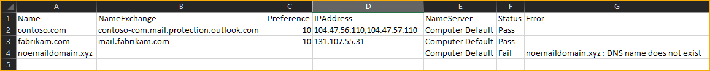

# PsMxRecordReport

[](https://github.com/junecastillote/PsMxRecordReport/issues)
[](https://github.com/junecastillote/PsMxRecordReport/network)


If you manage an email organization, one of the important configuration items you need to monitor is your organization's MX records. Missing or problematic MX records result in email deliverability problems.

This PowerShell module can help you setup a regular MX record lookup interval. You can choose to save the results to file (CSV) and/or create a pre-formatted HTML report. Depending on your requirement, you can also use the HTML output as an email report.

- [Requirements](#requirements)
- [Getting The Module](#getting-the-module)
- [Included Functions](#included-functions)
- [Usage Examples](#usage-examples)
  - [Example 1: Lookup MX Record And Create HTML Report File](#example-1-lookup-mx-record-and-create-html-report-file)
  - [Example 2: Lookup MX Record And Send HTML Report To Email](#example-2-lookup-mx-record-and-send-html-report-to-email)
- [Report Example](#report-example)
  - [HTML Report](#html-report)
  - [CSV Report](#csv-report)


## Requirements

There are no special requirements to run this module. You only need Windows PowerShell 5.1 or [PowerShell 7](https://github.com/PowerShell/powershell/releases/latest).

## Getting The Module

Similar to any GitHub sources, you can choose among these options:

- [Clone](https://docs.github.com/en/github/creating-cloning-and-archiving-repositories/cloning-a-repository) the [PsMxRecordReport](https://github.com/junecastillote/Ms365UsageReport) repository.
- [Download the module](https://github.com/junecastillote/Ms365UsageReport/archive/refs/heads/main.zip) as a Zip file.

## Included Functions

Click each function name below to view their respective documentation.

- [`Get-MxRecord`](docs/Get-MxRecord.md)
- [`Write-MxRecordReport`](docs/Write-MxRecordReport.md)

## Usage Examples

Below are some usage examples.

### Example 1: Lookup MX Record And Create HTML Report File

```PowerShell
# Remove Module from session (start fresh)
Remove-Module PSMXRecordReport -ErrorAction SilentlyContinue

# Import Module
Import-Module .\PSMXRecordReport.psd1

# Domain list
$domain = @('contoso.com','fabrikam.com','noemaildomain.xyz')

# Get Mx Record
$MxRecord = Get-MXRecord -Domain $domain

# Write HTML report and out to file
# Report output file
# ReportType options: All (Default), Pass, Fail
$MxRecord | Write-MxRecordReport -ReportType All | Out-File "c:\temp\MxRecordRport.html"
```

### Example 2: Lookup MX Record And Send HTML Report To Email

```powershell
# Remove Module from session (start fresh)
Remove-Module PSMXRecordReport -ErrorAction SilentlyContinue

# Import Module
Import-Module .\PSMXRecordReport.psd1

# Domain list
$domain = @('contoso.com','fabrikam.com','noemaildomain.xyz')

# Get Mx Record
$MxRecord = Get-MXRecord -Domain $domain

# Write HTML report and out to file
# Report output file
# ReportType options: All (Default), Pass, Fail
$htmlReport = $MxRecord | Write-MxRecordReport -ReportType All

# Build Email Parameters
$smtpCredential = Get-Credential
$emailSplat = @{
    Subject = 'MX Record Validity Report'
    SMTPServer = 'SMTP SERVER ADDRESS HERE'
    Port = 'SMTP SERVER PORT HERE'
    From = 'sender@domain.com'
    To = @('recipient1@domain.com','recipient2@domain.com')
    UseSSL = $true
    BodyAsHtml = $true
    Body = $htmlReport
    Credential = $smtpCredential
}
Send-MailMessage @emailSplat
```

## Report Example

### HTML Report


### CSV Report



Attribution:

<div>Icon made by <a href="https://www.flaticon.com/authors/catkuro" title="catkuro">catkuro</a> from <a href="https://www.flaticon.com/" title="Flaticon">www.flaticon.com</a></div>


<div>Media image by <a href="https://www.pexels.com/@pixabay" title="Pixabay">Pixabay</a> from <a href="https://www.pexels.com/photo/white-jigsaw-puzzle-illustration-262488/" title="Pexels">Pexels.com</a></div>