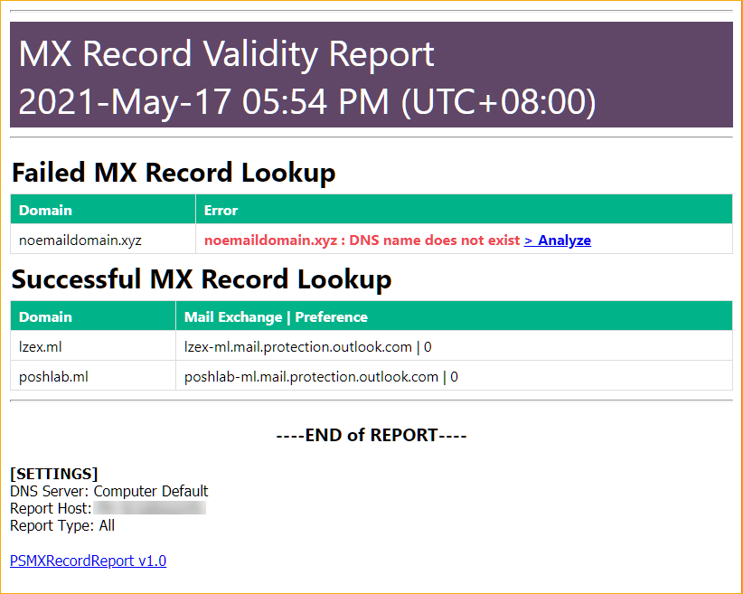

# Write-MXRecordReport <!-- omit in toc -->

Function to convert the output of the [`Get-MxRecord`](Get-MxRecord.md) cmdlet into a pre-formatted HTML report.

[Back to ReadMe](../README.md)

- [Syntax](#syntax)
- [Parameters](#parameters)
- [Examples](#examples)
	- [Example 1: Lookup MX Records And Create An HTML Report File](#example-1-lookup-mx-records-and-create-an-html-report-file)
	- [Example 2: Send The Report Via Email](#example-2-send-the-report-via-email)

## Syntax

```powershell
Write-MxRecordReport
 [-InputObject] <PSMXRecord>
 [[-Title] <string>]
 [[-ReportType] <string>]
 [<CommonParameters>]
```

## Parameters

**`-InputObject`**

Accepts the The `LazyExchangeAdmin.PsMxRecord` object output of the `Get-MxRecord` cmdlet. This parameter accepts input from the pipeline.

|                             |                              |
| :-------------------------- | ---------------------------- |
| Required:                   | True                         |
| Type:                       | LazyExchangeAdmin.PsMxRecord |
| Position:                   | Named                        |
| Default value:              | None                         |
| Accept pipeline input:      | True                         |
| Accept wildcard characters: | False                        |

**`-Title`**

The HTML report title you want. If not specified, this cmdlet will use the default value for this parameter.

|                             |                                                                     |
| :-------------------------- | ------------------------------------------------------------------- |
| Required:                   | False                                                               |
| Type:                       | [String](https://docs.microsoft.com/en-us/dotnet/api/system.string) |
| Position:                   | Named                                                               |
| Default value:              | 'MX Record Validity Report'                                         |
| Accept pipeline input:      | False                                                               |
| Accept wildcard characters: | False                                                               |

**`-ReportType`**

Set of limit which results you want to report. If not specified, this cmdlet will use the default value for this parameter. The valid options are:

- Pass - Report only the successful MX record lookup results.
- Fail - Report only the failed MX record lookup results.
- All - Report both successful and failed MX record lookup results.

|                             |                                                                     |
| :-------------------------- | ------------------------------------------------------------------- |
| Required:                   | False                                                               |
| Type:                       | [String](https://docs.microsoft.com/en-us/dotnet/api/system.string) |
| Position:                   | Named                                                               |
| Default value:              | 'All'                                                               |
| Accept pipeline input:      | False                                                               |
| Accept wildcard characters: | False                                                               |

## Examples

### Example 1: Lookup MX Records And Create An HTML Report File

This example performs MX record lookup, convert the output to a pre-formatted HTML report, and saves the result to a file.

```PowerShell
$Domain = @('poshlab.ml','lzex.ml','noemaildomain.xyz')
Get-MxRecord -Domain $Domain | Write-MxRecordReport | Out-File .\MxRecordReport-All.html
```

Result:



### Example 2: Send The Report Via Email

This example performs MX record lookup, convert the output to a pre-formatted HTML report, and send the report via email.

It is up to you how you want to send the HTML report. The key is to use the HTML output as the email body.

This example assumes that you are using the Office 365 authenticated SMTP relay.

```powershell
$Domain = @('nomailrecord.xyz','poshlab.cf','lazyexchangeadmin.cyou','lzex.ml','poshlab.ml')
$htmlReport = Get-MxRecord -Domain $Domain | Write-MxRecordReport

# Build Email Parameters
$smtpCredential = Get-Credential
$emailSplat = @{
    Subject = 'MX Record Validity Report'
    SMTPServer = 'SMTP SERVER ADDRESS HERE'
    Port = 'SMTP SERVER PORT HERE'
    From = 'sender@domain.com'
    To = @('recipient1@domain.com','recipient2@domain.com')
    UseSSL = $true
    BodyAsHtml = $true
    Body = $htmlReport
    Credential = $smtpCredential
}
Send-MailMessage @emailSplat
```
